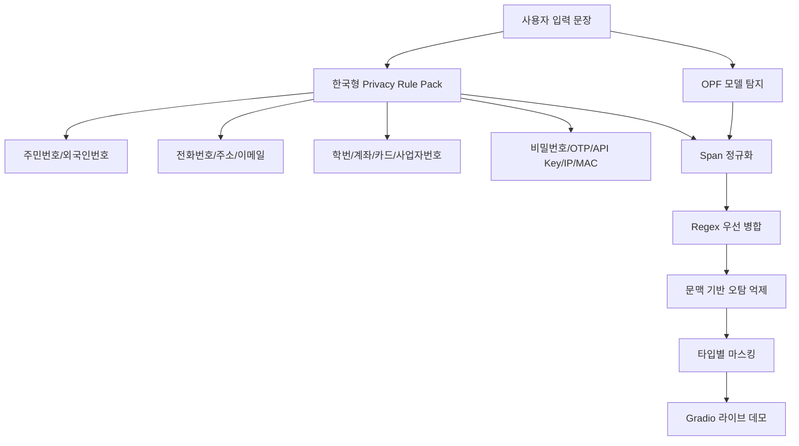

# K-Privacy Filter

한국어 문장에 포함된 개인정보를 탐지하고 `<PRIVATE_PERSON>`, `<PRIVATE_PHONE>`, `<ACCOUNT_NUMBER>`, `<SECRET>` 같은 타입별 토큰으로 마스킹하는 하이브리드 개인정보 필터입니다.

이 프로젝트는 OpenAI Privacy Filter(OPF)에 한국형 정규식 규칙팩과 문맥 기반 오탐 억제 로직을 결합해, 한국어 서비스에서 자주 등장하는 주민등록번호, 전화번호, 주소, 계좌번호, 학번, 비밀번호, API 키 등을 더 안정적으로 처리하는 것을 목표로 합니다.

## 필수 포함 항목

- [프로젝트 개요](#프로젝트-개요)
- [시스템 아키텍처](#시스템-아키텍처)
- [AI 도구 활용 전략(Prompting Log)](#ai-도구-활용-전략prompting-log)
- [실행 방법(How to run)](#실행-방법how-to-run)

## 프로젝트 개요

### 문제 정의

기본 개인정보 탐지 모델은 영어권 일반 PII에는 강하지만, 한국어 서비스에서 실제로 자주 쓰이는 표현에는 약한 부분이 있습니다.

- `내 이름은 최호준이고 전화번호는 010-1234-5678입니다.`
- `학번은 32215116이고 집 주소는 경기도 용인시 수지구 1336-2야.`
- `문서 버전은 sk-proj-example-not-real로 표시했습니다.`

위 예시처럼 한국어 문맥, 숫자형 식별자, API 키 형태 문자열, hard-negative 예시가 섞이면 단순 모델 또는 단순 정규식만으로는 누락과 오탐이 모두 발생합니다.

### 최종 구현 목표

- 한국어 개인정보를 타입별로 탐지하고 마스킹합니다.
- OPF 모델 결과와 한국형 규칙팩 결과를 병합합니다.
- 모델명, 문서 버전, 예시 문자열처럼 개인정보처럼 보이지만 실제 개인정보가 아닌 hard-negative를 억제합니다.
- Gradio 기반 라이브 데모 화면에서 입력, 마스킹 결과, 탐지 span, 요약 정보를 확인할 수 있습니다.

### 지원 라벨

| 라벨 | 의미 | 예시 |
|---|---|---|
| `private_person` | 사람 이름 | 홍길동, 최호준 |
| `private_address` | 주소 | 경기도 용인시 수지구 1336-2 |
| `private_email` | 이메일 | test@example.com |
| `private_phone` | 전화번호 | 010-1234-5678 |
| `private_url` | URL | example.com/u/hojun |
| `private_date` | 날짜, 생년월일 | 2001-03-04 |
| `private_network` | IP, MAC 주소 | 192.168.0.15 |
| `private_location` | 좌표 | 37.56650, 126.97800 |
| `account_number` | 계정형 식별자 | 주민번호, 학번, 계좌번호, 카드번호 |
| `secret` | 비밀값 | 비밀번호, OTP, API 키 |

## 시스템 아키텍처



### 처리 단계

1. **OPF 모델 탐지**

   OpenAI Privacy Filter가 일반 PII 후보 span을 탐지합니다.

2. **한국형 Privacy Rule Pack 탐지**

   한국어 환경에서 자주 쓰이는 정형 개인정보를 정규식과 문맥 규칙으로 보강합니다.

3. **Span 병합**

   OPF 결과와 규칙팩 결과가 겹치면 더 정확한 regex span을 우선합니다.

4. **Context Filter**

   `모델명`, `문서 버전`, `example`, `not-real`, `placeholder` 같은 주변 문맥이 있으면 개인정보가 아닌 값으로 판단해 마스킹하지 않습니다.

5. **마스킹 출력**

   탐지된 값을 `<LABEL>` 형식으로 바꾸고, 데모 UI에서는 라벨별 색상 배지로 보여줍니다.

### 주요 파일

| 파일 | 역할 |
|---|---|
| `scripts/pipeline.py` | OPF + 규칙팩 + Context Filter를 연결하는 최종 파이프라인 |
| `scripts/regex_safety_net.py` | 한국형 개인정보 정규식 및 문맥 규칙 |
| `scripts/demo.py` | Gradio 라이브 데모 서버 |
| `scripts/check_regex_rule_cases.py` | 규칙팩 smoke test |
| `scripts/evaluate_final_kpf_offline.py` | 최종 KPF 오프라인 평가 |
| `COLAB_LIVE_DEMO.md` | 발표용 Colab 원셀 실행 코드 |
| `results/final_presentation/` | 최종 발표 자료와 발표 대본 |

## AI 도구 활용 전략(Prompting Log)

이 프로젝트에서 AI는 단순 코드 생성기가 아니라, 실험 설계와 오류 분석을 함께 수행하는 협업 도구로 사용했습니다.

### 활용 전략

| 단계 | AI 활용 방식 | 산출물 |
|---|---|---|
| 문제 분석 | 한국어 개인정보 누락/오탐 사례를 AI와 함께 분류 | hard-negative, adversarial 테스트 케이스 |
| 규칙 설계 | 한국 개인정보 표현을 기준으로 정규식 후보를 생성하고 검토 | `regex_safety_net.py` |
| 실험 자동화 | Colab 실행, 로그 분석, 오류 원인 추적 | Colab 실행 셀, 평가 로그 |
| 평가 개선 | FP/FN 사례를 분석하고 규칙을 반복 보정 | Eval300, hard-negative, adversarial 결과 |
| 발표 준비 | 실험 결과를 PPT, 쉬운 발표 대본, 용어집으로 정리 | `results/final_presentation/` |
| 데모 개선 | UI 오류, 가독성, 라이브 데모 실행 흐름을 반복 수정 | `scripts/demo.py`, `COLAB_LIVE_DEMO.md` |

### Prompting Log 요약

아래는 실제 작업 흐름을 요약한 prompting log입니다.

1. **초기 분석 요청**

   Colab 노트북의 K-Privacy Filter 실험 구조를 분석하고, OPF와 한국형 규칙 보강이 필요한 지점을 찾도록 지시했습니다.

2. **오류 사례 기반 개선**

   사용자가 직접 입력한 실패 사례를 바탕으로 `아이디`, `비밀번호`, `학번`, `주소`, `API 키`, `모델명`, `문서 버전` 케이스를 반복 평가했습니다.

3. **Hard-negative 검증**

   `900101-1234567-A` 같은 모델명과 `sk-proj-example-not-real` 같은 문서 버전은 개인정보처럼 생겼지만 마스킹하지 않아야 하므로, hard-negative 테스트를 별도로 만들었습니다.

4. **한국형 이름 탐지 보강**

   사람 이름은 형식이 고정되지 않기 때문에 `내 이름은`, `수령자는`, `보호자`, `학생`, `담당 교사` 같은 문맥이 있을 때만 규칙적으로 잡도록 조정했습니다.

5. **라이브 데모 UI 개선**

   발표 현장에서 보여줄 수 있도록 Gradio UI를 대시보드 형태로 바꾸고, 글자색, 화면 비율, 입력창 테두리, 예시 버튼 제거 등을 반복 수정했습니다.

6. **발표 자료 정리**

   최종 결과를 발표용 PPT, 쉬운 발표 대본, 용어 설명 파일로 정리했습니다.

### AI 활용 원칙

- AI가 제안한 규칙은 바로 확정하지 않고, 실패 사례와 smoke test로 검증했습니다.
- 개인정보처럼 보이는 모든 문자열을 무조건 마스킹하지 않고, 문맥을 통해 오탐을 줄였습니다.
- fine-tuning 결과가 좋아 보이더라도 실제 Eval300, hard-negative, adversarial 테스트에서 약하면 최종 데모 후보에서 제외했습니다.

## 실행 방법(How to run)

### 1. Colab 라이브 데모 실행

발표 현장에서는 아래 셀 하나를 Colab에 붙여넣고 실행하면 됩니다. Google Drive 연결, 최신 GitHub 코드 불러오기, 패키지 설치, OPF 확인, Gradio 공개 링크 실행을 한 번에 수행합니다.

```python
import os
import re
import subprocess
import sys
from pathlib import Path

from google.colab import drive

REPO_URL = "https://github.com/helloiamhojun/k-privacy-filter.git"
WORKDIR = Path("/content/k-privacy-filter")
DRIVE_ROOT = Path("/content/drive/MyDrive/k-privacy-filter")

def run(command, cwd=None):
    print(f"\n$ {' '.join(command)}")
    subprocess.run(command, cwd=cwd, check=True)

def stream_demo(command, cwd=None):
    env = os.environ.copy()
    env["PYTHONUNBUFFERED"] = "1"
    print(f"\n$ {' '.join(command)}")
    process = subprocess.Popen(
        command,
        cwd=cwd,
        env=env,
        stdout=subprocess.PIPE,
        stderr=subprocess.STDOUT,
        text=True,
        bufsize=1,
    )
    try:
        assert process.stdout is not None
        for line in process.stdout:
            print(line, end="")
            match = re.search(r"https://[a-zA-Z0-9.-]+\.gradio\.live", line)
            if match:
                print("\n" + "=" * 72)
                print("LIVE DEMO URL:", match.group(0))
                print("Open this URL for the presentation.")
                print("Keep this Colab cell running while presenting.")
                print("=" * 72 + "\n")
        process.wait()
    except KeyboardInterrupt:
        print("\nDemo stopped. Run this cell again to reopen the live URL.")
        process.terminate()
        raise

print("[1/5] Mounting Google Drive")
drive.mount("/content/drive", force_remount=False)
DRIVE_ROOT.mkdir(parents=True, exist_ok=True)

print("[2/5] Loading latest KPF code")
if WORKDIR.exists() and (WORKDIR / ".git").exists():
    run(["git", "fetch", "origin"], cwd=WORKDIR)
    run(["git", "reset", "--hard", "origin/main"], cwd=WORKDIR)
else:
    if WORKDIR.exists():
        run(["rm", "-rf", str(WORKDIR)])
    run(["git", "clone", REPO_URL, str(WORKDIR)])

print("[3/5] Installing dependencies")
run([sys.executable, "-m", "pip", "install", "-q", "-r", "requirements.txt"], cwd=WORKDIR)

print("[4/5] Checking OPF import")
run([sys.executable, "-c", "from opf import OPF; print('OPF import OK')"], cwd=WORKDIR)

print("[5/5] Starting live Gradio demo")
print("Wait for LIVE DEMO URL. Do not stop this cell during the presentation.")
os.chdir(WORKDIR)
stream_demo([sys.executable, "-u", "scripts/demo.py"], cwd=WORKDIR)
```

실행 후 출력에 표시되는 `https://xxxxx.gradio.live` 링크를 열면 라이브 데모 화면을 볼 수 있습니다. 발표 중에는 Colab 셀을 중지하지 않아야 합니다.

### 2. 로컬 실행

```bash
git clone https://github.com/helloiamhojun/k-privacy-filter.git
cd k-privacy-filter
pip install -r requirements.txt
python scripts/demo.py
```

### 3. 규칙팩 smoke test

```bash
PYTHONPATH=scripts python scripts/check_regex_rule_cases.py
```

Windows PowerShell에서는 다음처럼 실행할 수 있습니다.

```powershell
$env:PYTHONPATH="scripts"
python scripts/check_regex_rule_cases.py
```

## 실험 결과

Main evaluation set은 한국어 템플릿 기반 300개 예시입니다.

| System / Set | Precision | Recall | Exact F1 | Covered Recall | False Positive |
|---|---:|---:|---:|---:|---:|
| Baseline OPF / Eval300 | 0.6716 | 0.5332 | 0.5945 | - | 0.3284 FPR |
| Existing Hybrid / Eval300 | 0.7471 | 0.6090 | 0.6710 | 0.7796 | 87 FP |
| Final KPF / Eval300 | 0.7994 | 0.6706 | 0.7294 | 0.8009 | 71 FP |

추가 스트레스 테스트:

| Test | Previous Hybrid | Final KPF |
|---|---:|---:|
| Sampled hard-negative 100 flagged | 100 / 100 | 0 / 100 |
| Adversarial exact F1 | 0.5263 | 0.9000 |
| Adversarial covered recall | 0.6000 | 1.0000 |

hard-negative 0/100 결과는 고정된 100개 sampled stress set에서의 결과입니다. 모든 가능한 입력에서 FPR이 0이라는 의미는 아닙니다.

## Fine-tuning 실험 메모

한국형 synthetic PII 데이터셋으로 fine-tuning도 실험했습니다.

- Dataset: train 50,000 / validation 5,000 / test 5,000
- Base model: `distilbert-base-multilingual-cased`
- Training subset: train 20,000 / validation 2,000
- Saved checkpoint: `results/korean_pii_finetune/distilbert_mbert_20k_20260529_success/final/model.safetensors`

하지만 standalone fine-tuned 모델은 hard-negative set에서 false positive가 많았고, 최종 발표 및 데모 후보는 `OPF + Korean Privacy Rule Pack + Context Filter` 하이브리드 파이프라인으로 결정했습니다.

## 발표 자료

- `results/final_presentation/K-Privacy-Filter-final-presentation.pptx`
- `results/final_presentation/final_presentation_script.md`
- `results/final_presentation/final_presentation_easy_script.md`
- `results/final_presentation/final_presentation_glossary.md`
- `results/final_presentation/final_demo_video_guide.md`

## License

- OpenAI Privacy Filter: Apache 2.0
- KLUE: CC-BY-SA-4.0
